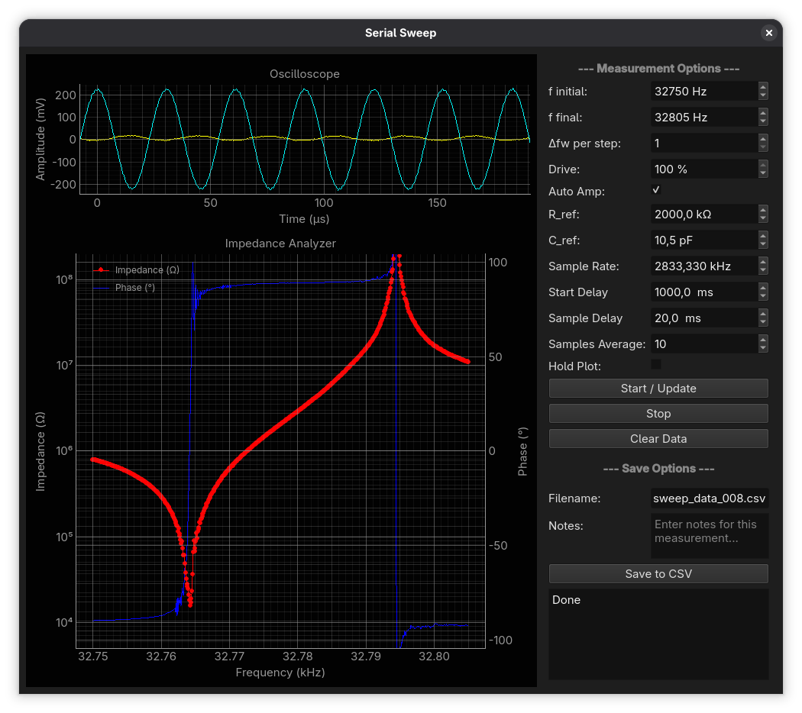

# STM32G431 Impedance Analyzer (WIP)

A firmware and toolset for generating and analyzing frequency sweeps on an STM32G431 "blackpill" board using its dual 4MSa/s ADC, DAC etc.

Contents
- `main.c` — firmware entry point
- `modules/` — firmware modules (ADC, DAC, SPI, USB serial, utilities)
- `libopencm3/` — libopencm3 firmware library (submodule)
- `sweepgui/` — Python GUI and helper scripts for running and saving sweeps

Requirements
- ARM embedded toolchain (e.g. `arm-none-eabi-gcc`)
- `make`
- `libopencm3` checked out as a submodule
- Python 3 for the GUI (`python3 sweepgui/app.py`) and Octave for `getspec.m` if you use the analysis scripts

Build
- Initialize libopencm3 (if not already):

  git submodule update --init --recursive

- Build firmware:

  make

- Build outputs appear in `build/` (ELF, disassembly, size, etc.)

Flash
- Use your preferred SWD/flashing tool (for example `st-flash` or DFU) to program the generated ELF/bin. The makefile also contains two programming commands: `make prog` (for st-flash) and `make dfu`.

Notes
- This repository contains firmware sources and desktop tools intended for development and measurement. Adjust flashing and build steps to match your hardware and toolchain.

Todo
- ~~Quite a lot of things: DAC waveform generation (currently uses a AD9833 DDS frequency generator), run the lockin detection/quadrature demodulation in STM32 instead of in the app/GUI, and apply an onboard PLL loop for resonance measurements.~~
- DDS/Lock-in base done, missing some things (see `ddsli.c`).
- PLL and application code for controlling the DDS/Lock-in for measurements.
- Fixing the USB CDC/ADC interface, sometime fails.
  - Add package structure with checksum and ack?
- Update `sweepgui` to use the DDS/lock-in.

GUI Screenshot

